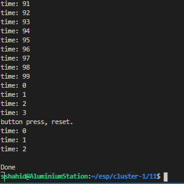

# Stopwatch

Author: Shazor Shahid

Date: 2020-09-21

-----

## Summary

enabled timer interrupts which increment a time variable on each alarm triggered.
connected to I2C display and current time shown.
button press initially enables counting and subsequent presses restart count.

## Sketches and Photos

## Modules, Tools, Source Used Including Attribution

## Supporting Artifacts

-----
