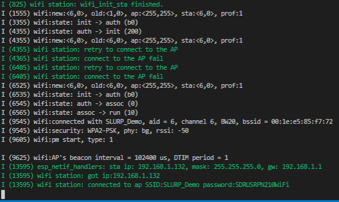
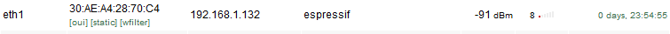

# ESP-WiFi

Author: Shazor Shahid

Date: 2020-10-22

-----

## Summary

successfully used ESP-IDF's example WiFi code to establish connection to EC444 provided router's WiFi.

## Sketches and Photos

## Modules, Tools, Source Used Including Attribution

- ESP WiFi Station example code

## Supporting Artifacts

ESP Connecting to WiFi

ESP located on router device list

-----
